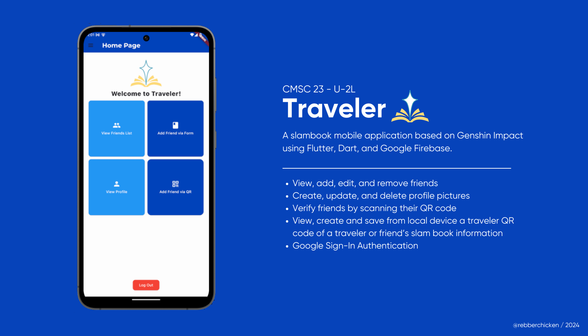
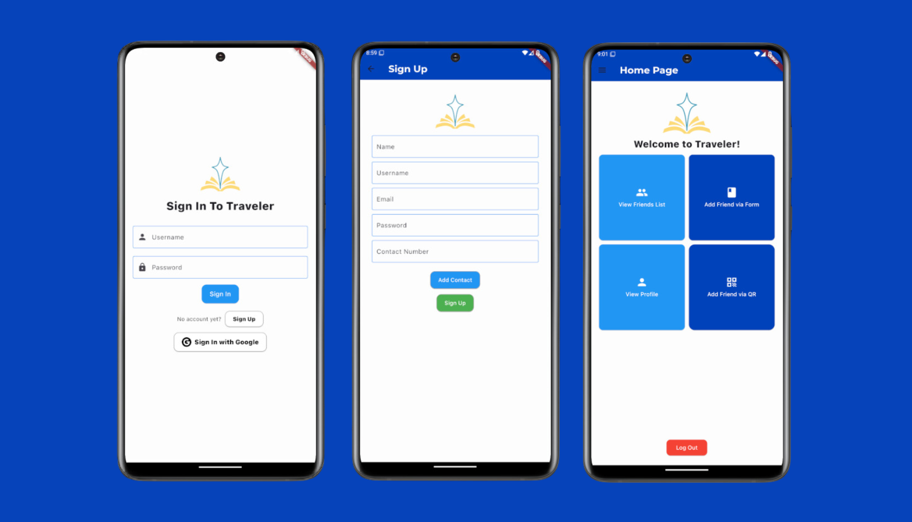
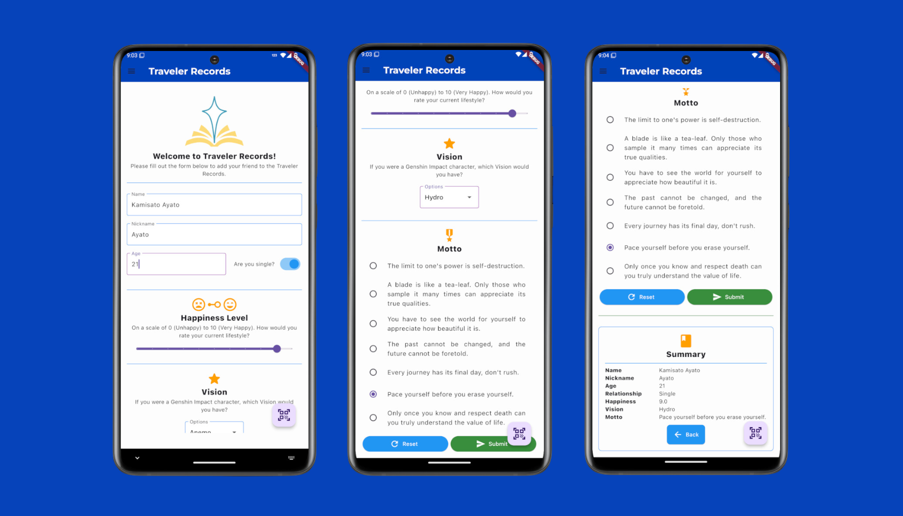
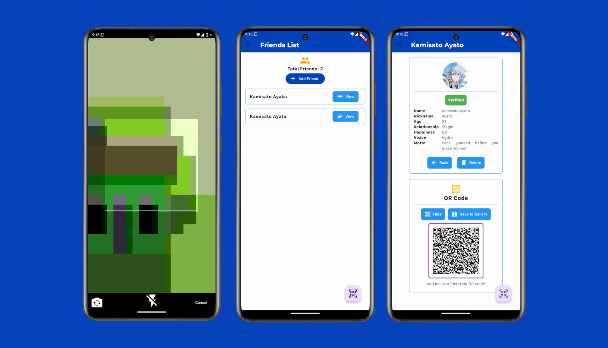
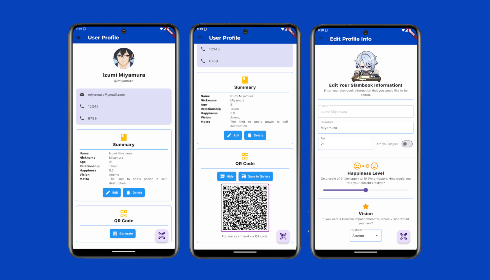

[](https://classroom.github.com/a/gO2BJkus)


# Welcome, Traveler!

## Table of Contents
- [Program Description](#program-description)
- [Features](#features)
- [Screenshots](#screenshots)
- [Getting Started](#getting-started)
  - [Prerequisites](#prerequisites)
  - [Installation](#installation)
  - [Firebase Configuration](#firebase-configuration)
- [Usage](#usage)
  - [Sign In and Sign Up](#sign-in-and-sign-up)
  - [Travel Buddies](#travel-buddies)
  - [QR Code Verification](#qr-code-verification)
  - [Save QR Code to Gallery](#save-qr-code-to-gallery)
- [Bugs](#bugs)
- [References](#references)

## Program Description


**Traveler** is a mobile slambook application inspired by Genshin Impact that allows users to add, update, and delete their friends through a slambook form or a QR code. The slambook form contains *Visions* (Anemo, Cryo, Dendro, etc.) and *Mottos* that are quotes from various Genshin Impact characters!

Users can also add profile pictures of their accounts and friends. They can verify their friends by scanning a QR code containing their information, preventing any unauthorized modifications to the friend's details. However, the profile picture can still be edited regardless of the friend's status.

This application uses *Dart* as its programming language, *Flutter* for its SDK, and *Google Firebase* for the backend. Firebase Cloud Firestore is used for database collections, Firebase Authentication for user providers, and Firebase Storage for handling profile pictures.

## Features

- **User Authentication**: Secure sign-in and sign-up using Firebase Authentication.
- **Slambook Form**: Add and edit friends with customizable fields, including Visions and Mottos.
- **QR Code Scanning**: Easily verify friends by scanning their QR codes.
- **Profile Picture Upload**: Upload and edit profile pictures for yourself and your friends.
- **Real-Time Updates**: Keep data synchronized across devices with Firebase Cloud Firestore.

## Screenshots

- **Sign In Page**:  
  

- **Slambook Form**:  
  

- **QR Code Scanner**:  
  

- **Profile Management**:  
  

## Getting Started

### Prerequisites

- Flutter SDK: Install the latest version of [Flutter](https://flutter.dev/docs/get-started/install).
- Firebase Account: Set up a [Firebase account](https://firebase.google.com/) and create a new project.

### Installation

1. **Clone the Repository:**
   ```bash
   git clone https://github.com/bernardjezua/traveler
   cd traveler
    ```
2. **Install Dependencies**
    ```bash
    flutter pub get
    ```
3. **Connect to Firebase**
    ```bash
    firebase login
    dart pub global activate flutterfire_cli
    flutterfire configure
    // DISCLAIMER: Set up your own firebase!
    ```
4. **Update `google-services.json`.**
5. **Create the APK or run the app using Flutter.**
    ```bash
    flutter build apk
    or
    flutter run
    ```

## Usage

### Sign In and Sign Up

- **Sign In**: Users can sign in using their username and password.
- **Sign Up**: Users need to provide their name, username, email, password, and contact number(s). Multiple contact numbers can be added.

### Travel Buddies

- **View**: Navigate to the "Friends List" section and you will see the list of friends you have. There is an option to view the information of that specific friend upon click.
- **Create**: Navigate to the "Add Friend" section to fill in the slambook form OR navigate using the QR Scanner button/page to scan and it will be added automatically.
- **Update**: Tap on a friend's profile to update their information (excluding name) OR scan using the QR code and it will update the information of them.
- **Delete**: Click on the delete button and a dialog will pop up, asking if you are sure you want to delete your friend.

### Traveler Profile

- **View**: Navigate to the "View Profile" section and you will see your contact details, and the slam book information.
- **Create**: You can create your own slambook information and this will appear below the contact details.
- **Update**: Click on the edit button and update the slambook information you would like to be edited, except for the name.
- **Delete**: Click on the delete button and a dialog will pop up, asking if you are sure you want to delete your slambook information.


### QR Code Verification

- Use the built-in QR code scanner through the floating action button or page to verify friends and access their information directly from the QR code.
- If a friend does not exist in the list yet, they will be added automatically to the list
- If a friend does exist, the data from the QR code will overwrite their current one instead of creating a new entity.

### Save QR Code to Gallery

- You can save a friend's QR code by going to their "View Friend" page in the friends list and select the "Generate" button below the slambook information. This will be stored in a folder called `FriendQRs`.
- You can also do the same for user's QR code by going to their "View Profile" page in the dashboard or navigation drawer. This will be stored in a folder called `TravelerQRs`.
- If you cannot search the QR code in the device, try to use the search function OR look in gallery.

## Bugs
1. If unverified friend has current profile picture, then the user updates profile picture, If you edit slam book info, it reverts back to the previous picture.
2. If friend has profile picture, upon removal, it does not remove the state of the picture since it is dependent in the friends list page to retrieve the data.
3. Upon Sign Up -> Log Out -> Sign In with Google -> Username and Password login is no longer available.


## References

- Abdullah. (2024). Type “String” is not a subtype of type “Null” in get method flutter. Retrieved from Stack Overflow website: https://stackoverflow.com/questions/59955033/type-string-is-not-a-subtype-of-type-null-in-get-method-flutter
- Ashutosh, A. (2023). QRScan Flutter: How to scan and generate QR code in Flutter. Retrieved from Blup.in website: https://www.blup.in/blog/qrscan-flutter-how-to-scan-and-generate-qr-code-in-flutter
- Cahyadi, G.D. (2024, January 13). Implementing Google Sign-In Authentication in Flutter with Supabase. Retrieved from Medium website: https://medium.com/@fianto74/implementing-google-sign-in-authentication-in-flutter-with-supabase-acf7f33a98b1/
- Flutterfire. (n.d.). Using Firebase Authentication. Retrieved from Flutter.dev website: https://firebase.flutter.dev/docs/auth/usage/
- GeeksforGeeks. (2021, January 15). How to Create Dynamic ListView in Android using Firebase Firestore? Retrieved from GeeksforGeeks website: https://www.geeksforgeeks.org/how-to-create-dynamic-listview-in-android-using-firebase-firestore/
- HoYoLAB - Official Community. (2024). Retrieved from Hoyolab.com website: https://www.hoyolab.com/article/17186521
- miHoYo. (2020). *Genshin Impact* [Video game]. miHoYo. https://genshin.mihoyo.com
- Mustafa, H. (2023). *Flutter Cloud Firestore Tutorial - CRUD (Create, Read, Updated, Delete) Cloud Firestore Guide* [YouTube Video]. Retrieved from https://www.youtube.com/watch?v=G0rsszX4E9Q
- PandaSuite. (2024, May 28). *Save User Data in Firebase*. Retrieved from Pandasuite.com website: https://learn.pandasuite.com/article/946-associate-data-to-user-with-firebase
- Pinterest. (2023). *Genshin Impact Icons*. Retrieved from Pinterest website: https://ph.pinterest.com/aixaortizhuallpa/genshin-impact-icons/
- Sorathiya, N. (2024, February 9). The Ultimate Guide to Flutter Permission Handler. Retrieved from Dhiwise.com website: https://www.dhiwise.com/post/how-to-implement-flutter-permission-handler
- Tutorialspoint.com. (n.d.). ‌*Dart Programming - Debugging*. Retrieved from Tutorialspoint.com website: https://www.tutorialspoint.com/dart_programming/dart_programming_debugging.htm
- Walter, K. (2024). *Getting permission to the external storage*. Retrieved from Stack Overflow website: https://stackoverflow.com/questions/50561737/getting-permission-to-the-external-storage-file-provider-plugin

##
